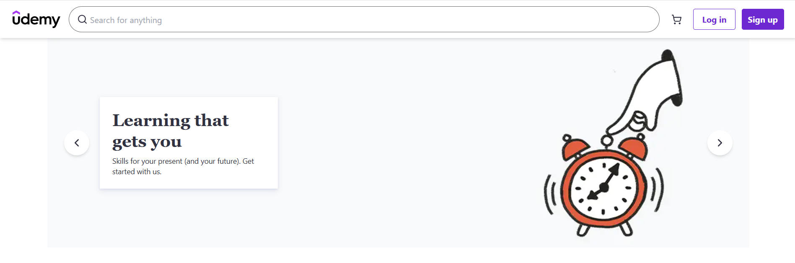
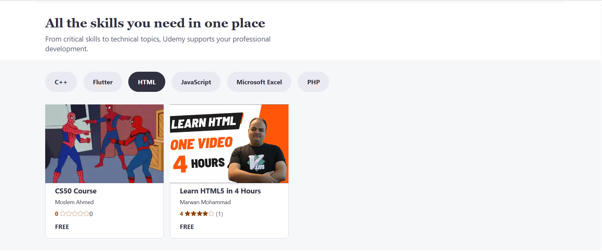
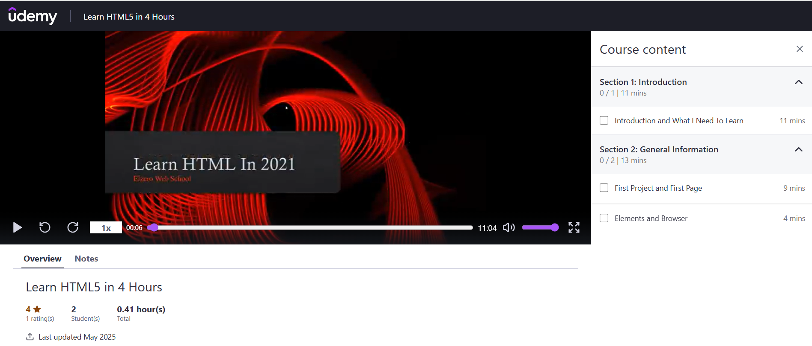
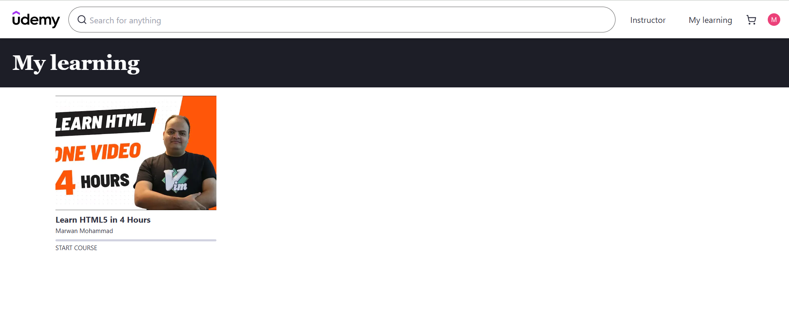
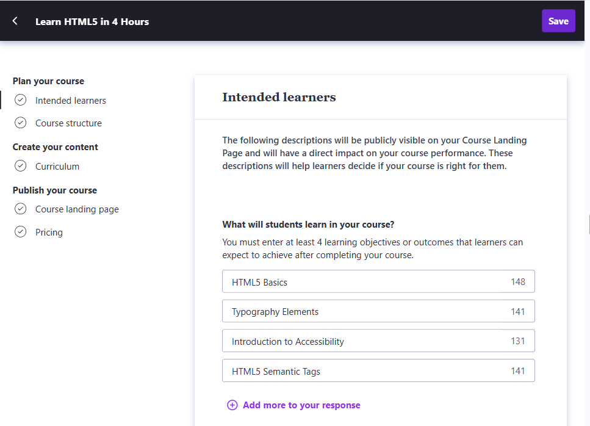
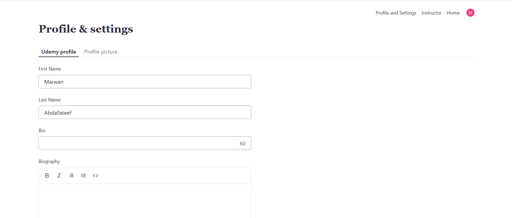

# 🎓 Udemy Clone - Online Learning Platform

A modern, full-featured online learning platform built with Next.js 15, inspired by Udemy. This project provides a complete e-learning experience with course creation, course enrollment and management, payments.


## ✨ Features

### 🎯 Core Features

- **Course Management**: Create courses with modular curriculum
- **Video Streaming**: Video player with playback controls and timestamps
- **User Authentication**: Sign-up/sign-in with Clerk
- **Payment Processing**: Integrated Stripe checkout
- **Shopping Cart**: Add courses to cart and complete purchases
- **Student Dashboard**: Track learning progress and view enrolled courses
- **Instructor Dashboard**: Comprehensive course management

### 🎥 Learning Experience

- **Interactive Video Player**: Custom controls with seek & playback speed
- **Note Taking**: Students can take timestamped notes during lectures
- **Progress Tracking**: Monitor completion status across modules and lectures
- **Course Rating**: Students can rate courses
- **Mobile Responsive**: Fully optimized for all device sizes

### 👨‍🏫 Instructor Features

- **Comprehensive Course Creation**: Add details about course
- **Video Upload**: Supabase integration for secure video storage
- **Pricing Management**: Set course price

### 🛍️ E-commerce Features

- **Shopping Cart**: Add/remove courses with persistent storage
- **Secure Checkout**: Stripe-powered payment processing

## 📸 Screenshots

### 🏠 Homepage



### 📚 Course Catalog



### 🎥 Course Learning Experience



### 📖 Student Dashboard


_Personalized learning dashboard to track progress and manage enrolled courses_

### 🎓 Course Creation


_Intuitive course creation interface for instructors_

### 👨‍🏫 Instructor Profile



## 🛠️ Tech Stack

### Frontend

- **Framework**: Next.js 15 with App Router
- **Language**: TypeScript
- **Styling**: Tailwind CSS
- **Icons**: Lucide React
- **State Management**: React Context API
- **Testing**: Jest

### Backend & Services

- **Database**: Firebase Storage
- **Authentication**: Clerk
- **Payments**: Stripe
- **File Storage**: Supabase (PostgreSQL)

## 🚀 Getting Started

### Prerequisites

- Node.js 18.0 or later
- npm or yarn package manager
- Git

### Environment Variables

Create a `.env.local` file in the root directory:

```env
# Clerk Authentication
NEXT_PUBLIC_CLERK_PUBLISHABLE_KEY=your_clerk_publishable_key
CLERK_SECRET_KEY=your_clerk_secret_key
NEXT_PUBLIC_CLERK_SIGN_IN_URL=/sign-in
NEXT_PUBLIC_CLERK_SIGN_UP_URL=/sign-up

# Supabase
NEXT_PUBLIC_SUPABASE_URL=your_supabase_url
NEXT_PUBLIC_SUPABASE_ANON_KEY=your_supabase_anon_key
SUPABASE_SERVICE_ROLE_KEY=your_supabase_service_role_key

# Stripe
NEXT_PUBLIC_STRIPE_PUBLISHABLE_KEY=your_stripe_publishable_key
STRIPE_SECRET_KEY=your_stripe_secret_key
STRIPE_WEBHOOK_SECRET=your_stripe_webhook_secret

# Firebase
NEXT_PUBLIC_FIREBASE_API_KEY=your_firebase_api_key
NEXT_PUBLIC_FIREBASE_AUTH_DOMAIN=your_firebase_auth_domain
NEXT_PUBLIC_FIREBASE_PROJECT_ID=your_firebase_project_id
NEXT_PUBLIC_FIREBASE_STORAGE_BUCKET=your_firebase_storage_bucket
NEXT_PUBLIC_FIREBASE_MESSAGING_SENDER_ID=your_firebase_messaging_sender_id
NEXT_PUBLIC_FIREBASE_APP_ID=your_firebase_app_id
```

### Installation

1. **Clone the repository**

   ```bash
   git clone https://github.com/Marwan878/udemy-clone.git
   cd udemy-clone
   ```

2. **Install dependencies**

   ```bash
   npm install
   ```

3. **Set up environment variables**

   - Copy `.env.example` to `.env.local`
   - Fill in your service credentials

4. **Run the development server**

   ```bash
   npm run dev
   ```

5. **Open your browser**
   Navigate to [http://localhost:3000](http://localhost:3000)

### Available Scripts

```bash
npm run dev        # Start development server
npm run build      # Build for production
npm run start      # Start production server
npm run lint       # Run ESLint
npm run test       # Run Jest tests
npm run test:watch # Run tests in watch mode
```

## 📁 Project Structure

```
udemy/
├── src/
│   ├── app/                    # Next.js App Router
│   │   ├── (auth)/            # Authentication routes
│   │   ├── (landing)/         # Landing page components
│   │   ├── (user)/            # User dashboard routes
│   │   ├── course/            # Course-related pages
│   │   ├── instructor/        # Instructor dashboard
│   │   └── api/               # API routes
│   ├── actions/               # Server actions
│   │   ├── cart/              # Cart operations
│   │   ├── courses/           # Course CRUD operations
│   │   ├── instructor/        # Instructor operations
│   │   ├── payment/           # Payment processing
│   │   └── user/              # User management
│   ├── components/            # Reusable UI components
│   │   └── general/           # Generic components
│   ├── constants/             # Application constants
│   ├── contexts/              # React Context providers
│   ├── lib/                   # External service configurations
│   └── types/                 # TypeScript type definitions
├── public/                    # Static assets
│   ├── images/               # Image assets
│   └── fonts/                # Font files
└── config files              # Various configuration files
```

### Key Directories

- **`/app`**: Next.js 13+ App Router with route groups
- **`/components`**: Reusable UI components following atomic design
- **`/actions`**: Server-side functions for data operations
- **`/contexts`**: React Context for global state management
- **`/types`**: Comprehensive TypeScript definitions
- **`/lib`**: Third-party service integrations

```bash
# Run all tests
npm run test

# Run tests in watch mode
npm run test:watch

# Run tests with coverage
npm run test -- --coverage
```

## 🚀 Deployment

### Vercel (Recommended)

1. Connect your GitHub repository to Vercel
2. Configure environment variables in Vercel dashboard
3. Deploy automatically on push to main branch

## 🤝 Contributing

1. Fork the repository
2. Create a feature branch (`git checkout -b feature/amazing-feature`)
3. Commit your changes (`git commit -m 'Add amazing feature'`)
4. Push to the branch (`git push origin feature/amazing-feature`)
5. Open a Pull Request

## ✅ Acknowledgments

- [Next.js](https://nextjs.org/) for the amazing React framework
- [Clerk](https://clerk.com/) for authentication services
- [Supabase](https://supabase.com/) for database and backend services
- [Stripe](https://stripe.com/) for payment processing
- [Tailwind CSS](https://tailwindcss.com/) for styling utilities
